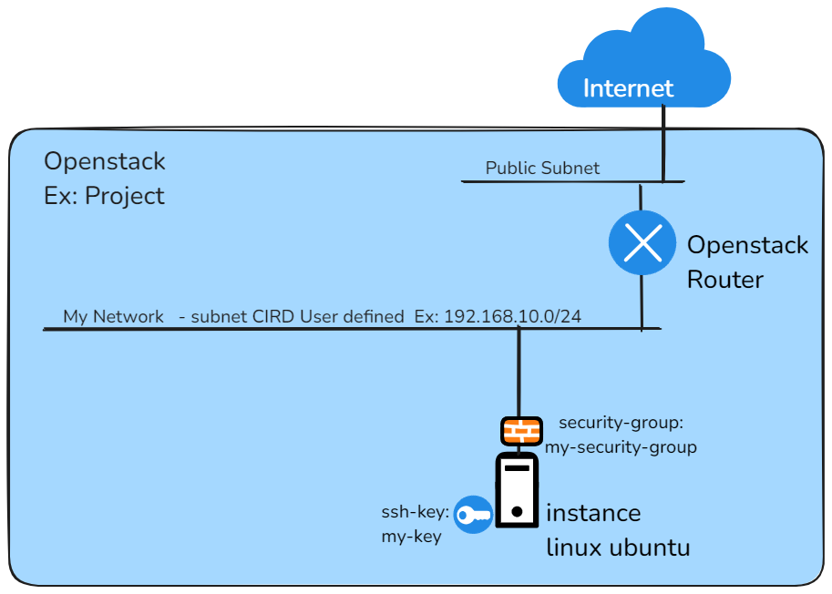

# openstack-edge-instancia-ubuntu  

Com esse codigo é possivel criar uma estrutura IaaC ( Infrastructure as a Code)  na Cloud Embratel baseada em Openstack ( Openstack Edge),  
que cria componentes principais para uma arquitetura simples representada no desenho abaixo:

 
 
Para utilizar esse projeto é necessario ter o terraform instalado na estação que o codigo ira rodar, para instalar e fazer o download utilize o site abaixo: 
https://developer.hashicorp.com/terraform/install   
 
assim que clonar o projeto é possivel gerar chaves ssh para o seu projeto utilizando o script cria-chave.sh  
./cria-chave.sh 
 
na sequencia configure o arquivo terraform.tfvars com as credenciais referentes ao seu projeto:  
os_auth_url         = "https://identity.spo1.edge.embratel.cloud:5000/v3" 
os_username         = "Username1"        
os_password         = "Password"         
os_tenant_name      = "xxxxxxx-project"  
os_domain           = "xxxxxxx-domain"   
os_region           = "spo1"             
 
uma vez configurado vc pode editar o arquivo de variaveis variables.tf para editar variaveis como: 
-endereçamento de rede  
-endereço do gateway    
-endereço da instancia  
 
assim que os pa rametros estiverem definidos é só iniciar o terraform e rodar o script:  
terraform init 
terraform plan 
teraform  apply 

quando a estrutura não for mais necessária é só rodar o script para destrui-la 
terraform destroy 

